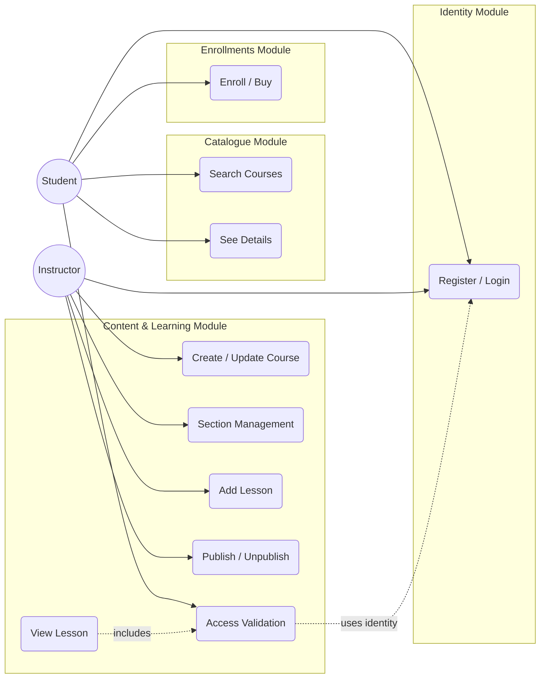

# Requerimientos Funcionales y Alcance (MVP)

> **Propósito del documento:** Definir el alcance funcional para la primera versión (MVP) de la 
> plataforma de cursos, estableciendo límites claros para el desarrollo bajo arquitectura modular. 

## 1. Actores del Sistema
* **Estudiante (Student):** Usuario que busca, se inscribe y consume contenido educativo.
* **Instructor (Instructor):** Usuario que gestiona, publica y organiza el contenido de sus cursos.
* **Sistema (System):** Procesos automáticos (Ej.: Validaciones, notificaciones asíncronas).

## 2. Diagrama de Casos de Uso (Alto Nivel)

## 3. Requerimientos por Módulo (MVP)
A continuación se detallan las funcionalidades "Core" que deben estar presentes para considerar el
producto fiable.

### Módulo: Identidad (Identity Module)
_Responsabilidad: Gestión de usuarios, autenticación y roles._
* **RF-01 Registro de Usuario:** El sistema debe permitir registrar nuevos usuarios solicitando: Nombre,
Email y Contraseña.
    * _Regla:_ El email debe ser único en el sistema.
    * _Regla:_ La contraseña debe ser almacenadas de forma segura (encriptada/hasheada).
* **RF-02 Autenticación (Login):** El usuario debe poder ingresar con su email y contraseña. El sistema
devolverá un mecanismo de acceso (Ej.: Token JWT) si las credenciales son válidas.
* **RF-03 Asignación de Roles:** Al registrarse, el sistema debe asignar un rol por defecto.
  * _Nota_: Para el MVP, se puede definir el rol (Estudiante o Instructor) en el momento del registro
  o tener un endpoint separado para "convertirse en instructor".

### Módulo: Catálogo (Catalogue Module)
_Responsabilidad: Visualización pública, búsqueda y filtrado de cursos._
* **RF-04 Listado de Cursos:** El sistema debe listar los cursos disponibles para la venta.
  * _Regla:_ Solo se debe mostrar cursos con estado `Publicado`. Los borradores son invisibles aquí.
  * _Nota:_ El listado debe estar **paginado** (Ej.: 10 cursos por página) para optimizar el rendimiento
  de la base de datos.
* **RF-05 Búsqueda y Filtrado:** El usuario debe poder buscar cursos mediante una cadena de texto.
  * _Regla:_ La búsqueda se realizará por coincidencia en el `Título` del curso (LIKE o Contains).
* **RF-06 Detalle de Curso:** Visualización pública de la información del curso (Título, Descripción,
Precio, Autor y Temario).
  * _Nota:_ No se debe exponer la URL de los videos en este endpoint, solo la estructura del temario
    (Títulos de lecciones).

### Módulo: Inscripciones (Enrollments Module)
_Responsabilidad: Gestión de compras y registro de alumnos en cursos._
* **RF-07 Inscripción a Curso**: El estudiante puede inscribirse en un curso publicado.
  * _Regla:_ El sistema debe validar que el usuario no esté ya inscrito en ese curso (Evita duplicados).
  * _MVP:_ Dado que no habrá pasarela de pagos real, la inscripción cambiará el estado directamente a
  `ACTIVA` tras confirmar la acción.
* **RF-08 Consulta de "Mis Cursos":** El estudiante debe poder ver un listado de todos los cursos en los
que se ha inscrito exitosamente.

### Módulo: Contenido y Aprendizaje (Content & Learning Module)
* **RF-09 Gestión de Cursos (ABM):** El instructor puede Crear, Leer y Actualizar la información básica
de sus cursos.
  * _Regla:_ Un curso nace siempre en estado `BORRADOR`.
* **RF-10 Gestión de Estructura (Secciones y Lecciones):** El instructor puede agregar módulos (secciones)
y lecciones dentro de ellos.
  * _Nota:_ Las lecciones contendrán la URL del video y/o contenido de texto.
* **RF-11 Ciclo de Vida (Publicación):** El instructor controla la visibilidad del curso.
  * **Publicar**: Cambia de estado a `PUBLICADO`. _Validación:_ El curso debe tener al menos una lección
  creada para poder publicarse.
  * **Archivar**: Regresa el estado a `BORRADOR` (ocultándolo del catálogo, pero manteniendo acceso a
  inscritos previos).
* **RF-12 Consumo de Contenido (Ver Lección):** El estudiante puede acceder al contenido (video/texto) de
una lección específica.
  * _Seguridad:_ El sistema **DEBE validar** contra el Módulo de Inscripciones que el usuario solicitante
  tenga una inscripción activa para el curso al que pertenece la lección. Si no, devuelve `403 Forbidden`.

## 4. Fuera de Alcance (Out of Scope / V2)
Las siguientes funcionalidades están explícitamente **EXCLUIDAS** de esta versión para garantizar la entrega
del MVP y mantener la arquitectura simple inicialmente.
* **Pagos Reales:** Integración con Stripe/MercadoPago (Queda para fase V2).
* **Sistema de Reviews:** Valoraciones y comentarios de estudiantes.
* **Exámenes/Quizzes:** Evaluaciones multiple choice.
* **Certificados PDF:** Generación de diplomas al finalizar.
* **Chat/Preguntas:** Sistema de Q&A entre alumno e instructor.
* **Transcodificación de Video:** Se usarán URLs directas (Ej.: YouTube/Vimeo) o subida cruda a MinIO sin
procesamiento.