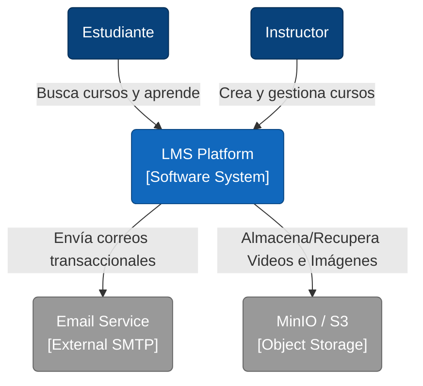
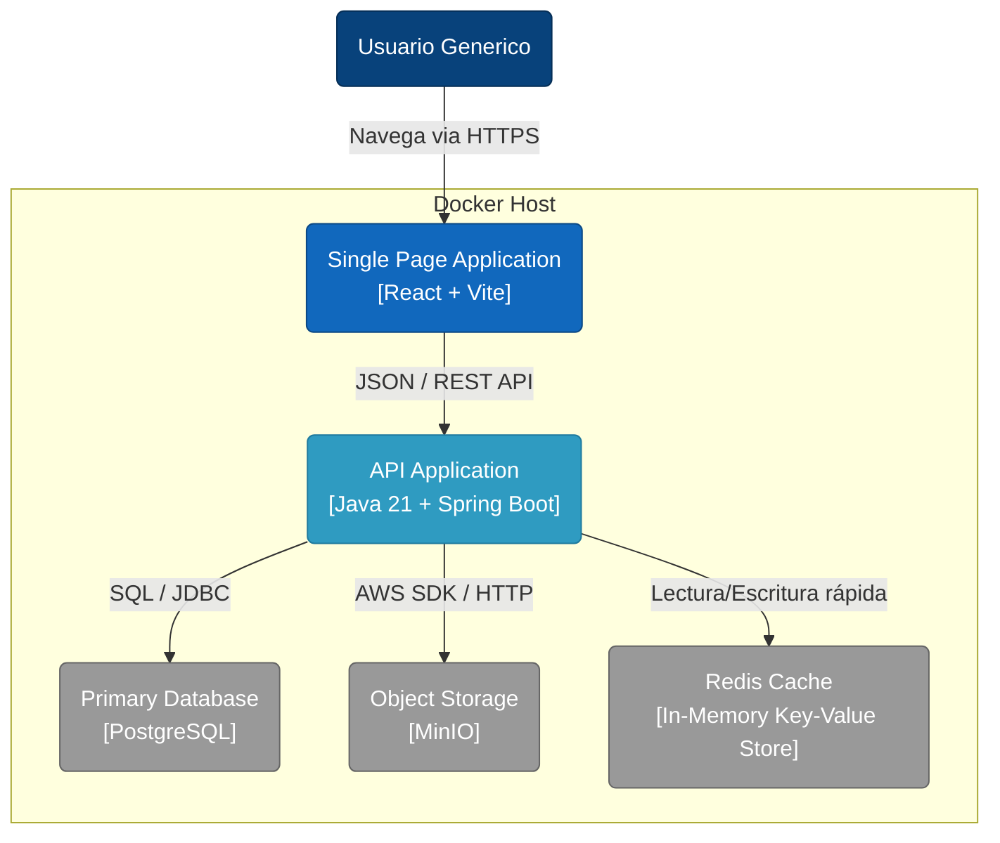
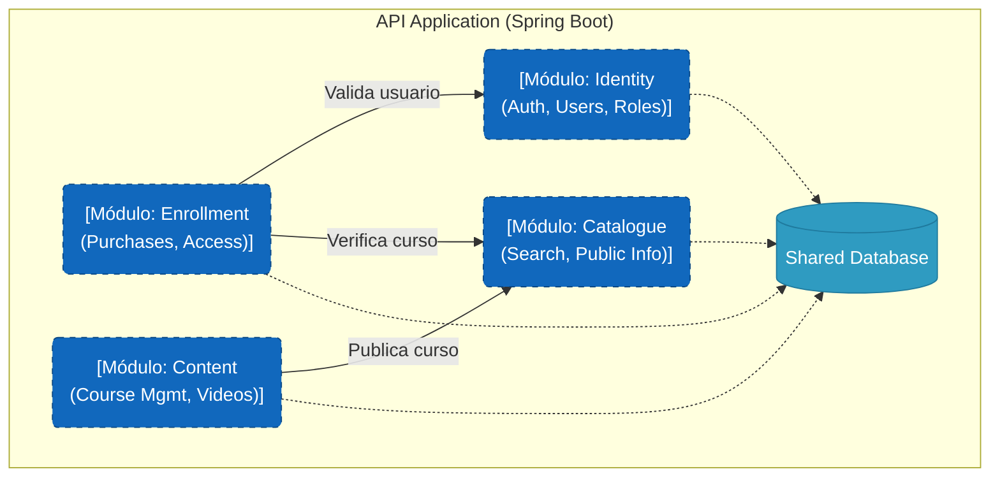

# C4 Model - Architecture Overview

> **Propósito del documento:** Este documento describe la arquitectura estática del
> sistema utilizando el modelo C4. Se enfoca en cómo el sistema interactúa con los
> usuarios, sus dependencias externas y su estructura interna modular.

---

## Nivel 1: Diagrama de Contexto (System Context)

*La "foto satelital". Muestra el sistema como una caja negra y sus interacciones con el
mundo exterior.*

### Descripción

* **LMS Platform:** El núcleo de nuestra solución.
* **Email Service:** Servicio externo (o servidor SMTP) para notificaciones de bienvenida
  y recuperación de contraseña.
* **MinIO / S3:** Almacenamiento de objetos desacoplado para gestionar archivos binarios
  pesados (Videos de lecciones, Portadas).

---

## Nivel 2: Diagrama de Contenedores (Container)

*Zoom-in a la infraestructura. Muestra las unidades desplegables y tecnologías elegidas.*

### Decisiones Clave

1. **Single Page Application (SPA):** El frontend está totalmente desacoplado del backend,
   permitiendo despliegues independientes de la UI.
2. **Spring Boot API:** Actúa como el orquestador central y "Monolito Modular".
3. **MinIO Local:** Se utiliza una instancia contenerizada de MinIO para simular AWS S3
   en el entorno de desarrollo y MVP.
4. **PostgreSQL:** Base de datos relacional robusta y ampliamente soportada.

---

## Nivel 3: Diagrama de Componentes (Modular Monolith Structure)

*Zoom-in al Backend. Aquí se evidencia la arquitectura **Spring Modulith***

En lugar de capas horizontales (Controller -> Service -> Repository), visualizamos
**Módulos Verticales** encapsulados.

### Arquitectura Interna

* **Separación Lógica:** Aunque todo corre en un solo proceso Java (`.jar`), el código
  está organizado en paquetes raíz separados.
* **Comunicación:** Los módulos se comunican principalmente a través de:
    1. **Eventos de Dominio** (Asíncrono - Ej.: `CoursePublishedEvent`).
    2. **Interfaces Públicas** (Síncrono - Ej.: `IdentityService` expuesto).
* **Aislamiento:** Cada módulo tiene su propia capa de persistencia interna, inaccesible
  para los otros módulos directamente.