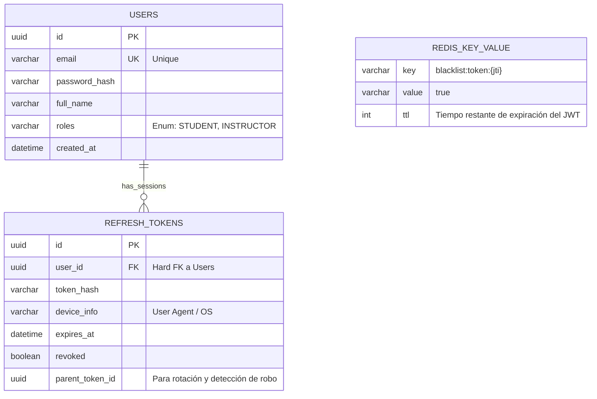
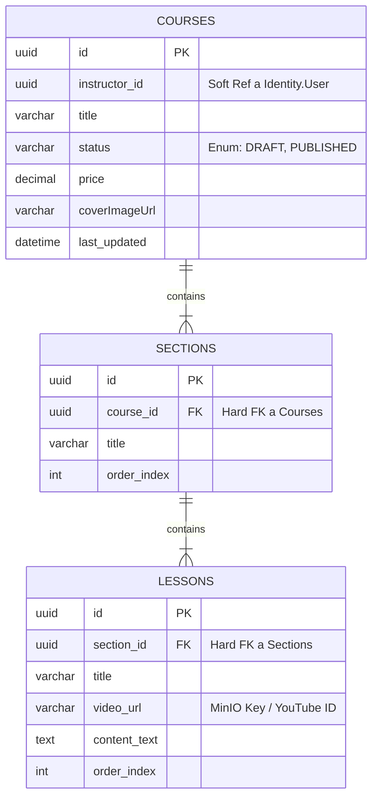
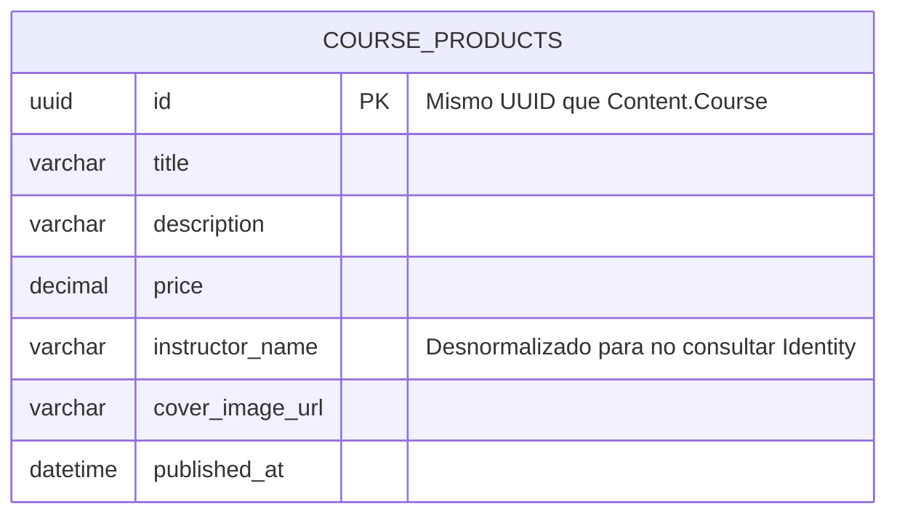
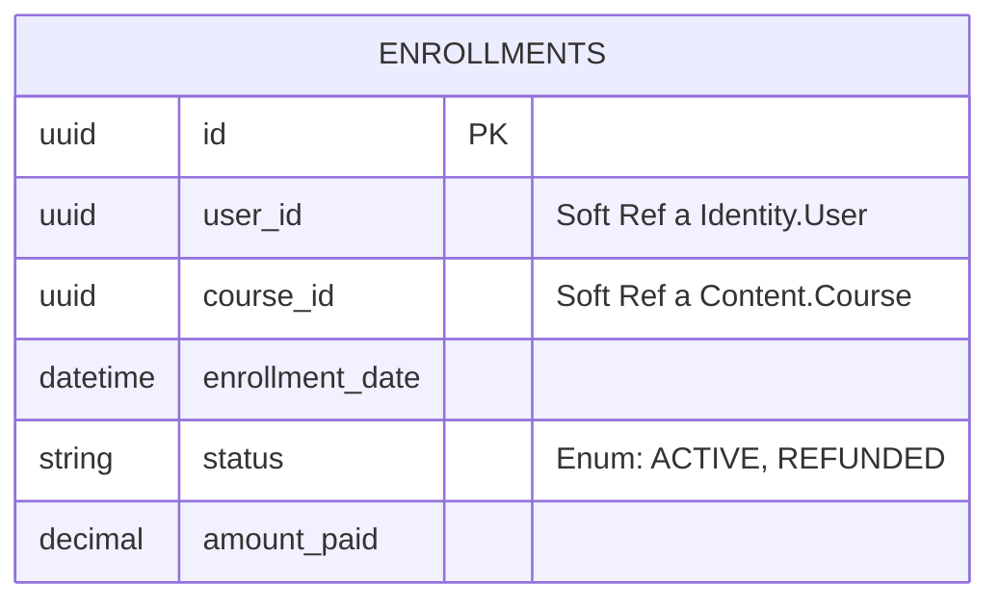

# Database Entity Relationship Diagram (ERD)

> **Propósito del documento:** Este documento detalla el esquema de base de datos para el MVP. El diseño 
> sigue el patrón **Database-per-Module** (lógico), utilizando esquemas de PostgreSQL o prefijos de tabla
> para aislar los contextos.

**Nota de Arquitectura:** Las relaciones entre tablas de distintos módulos son **Lógicas (Soft References)**,
no físicas. No se utilizan Foreign Keys (FK) entre módulos para permitir la futura extracción a microservicios.

## 1. Módulo: Identity (Seguridad)
*Prefijo sugerido: `ident_` o schema `identity`*

Encargado de usuarios y sesiones. No sabe nada de cursos ni compras.

> *Nota:* La tabla `REDIS_KEY_VALUE` se utiliza para almacenar claves efímeras de tokens revocados. La
> expiración (TTL) se ajusta automáticamente al tiempo de vida restante del JWT.

## 2. Módulo: Content (Gestión Educativa)
*Prefijo sugerido: `cont_` o schema `content`*

Donde los instructores crean la estructura. Aquí vive la "verdad" del contenido.

## 3. Módulo: Catalogue (Vidrieda Pública)
*Prefijo sugerido: `cat_` o schema `catalogue`*

Optimizado para lectura rápida. Es una proyección de los datos del curso.

* **Nota:** Esta tabla se llena escuchando el evento `CoursePublishedEvent` del módulo Content.

## 4. Módulo: Enrollment (Inscripciones)
*Prefijo sugerido: `enr_` o schema `enrollment`*

Registro transaccional de acceso.

