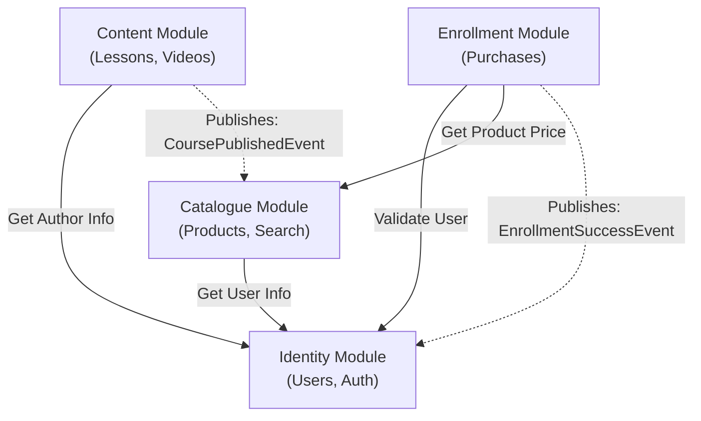

# Límites de Módulos y Reglas de Interacción

> Este documento define las fronteras estrictas entre los módulos del sistema (Bounded Contexts).
> El objetivo es mantener bajo acoplamiento, permitiendo que cada módulo evolucione (o se extraiga a un microservicio)
> sin romper a los demás.

---

## 1. Matriz de Dependencias Permitidas

La regla de oro es evitar **Dependencias Cíclicas** (A depende de B, y B depende de A). Para lograrlo, establecemos una
jerarquía clara:

| Módulo (Origen) | Puede depender de... (Destino) | Tipo de Comunicación | Razón                                                                |
|:----------------|:-------------------------------|:---------------------|:---------------------------------------------------------------------|
| **Identity**    | *Ninguno*                      | N/A                  | Es el núcleo (Kernel). No sabe nada del negocio educativo.           |
| **Catalogue**   | **Identity**                   | Síncrona (Método)    | Necesita datos básicos del Instructor para mostrar en la ficha.      |
| **Enrollments** | **Identity**, **Catalogue**    | Síncrona (Método)    | Valida que el usuario y el producto (curso) existan antes de cobrar. |
| **Content**     | **Identity**                   | Síncrona (Método)    | Asigna autoría a los cursos.                                         |

> **Nota Crítica:** El módulo **Content** NO conoce a **Catalogue** ni a **Enrollments**.
> * ¿Cómo se actualiza el catálogo cuando se crea un curso? -> **Eventos**.
> * ¿Cómo sabe Content si el usuario pagó? -> No lo sabe directamente. Delega la validación de acceso.

---

## 2. Diagrama de Flujo de Comunicación



---

## 3. Interfaces Públicas vs. Privadas (Spring Modulith)

Para hacer cumplir estos límites en el código Java, usaremos la visibilidad de paquetes.

### Estructura de Paquetes

Cada módula tendrá esta estructura:

```text
com.projects.openlearning.<module_name>
├── api          <-- PÚBLICO: DTOs, Eventos e Interfaces de Servicio expuestas.
├── internal     <-- PRIVADO: Entidades, Repositorios, Implementaciones.
└── web          <-- PRIVADO: Controllers REST (Solo accesibles vía HTTP).
```

### Reglas de Visibilidad

1. **Solo se puede importar clases del paquete `.api` de otro módulo.**
2. Está **PROHIBIDO** importar una Entidad (@Entity) de otro módulo.
    * *Ejemplo:* `Enrollment` no puede usar `Content.Course`. Debe usar
    `Catalogue.CourseDTO` o guardar solo el ID.
3. **Base de Datos Aislada:** Ningún módulo puede hacer Joins con tablas de otro módulo.

---

## 4. Estrategia de Eventos (Desacoplamiento)

Cuando una acción en un módulo debe tener efectos secundarios en otro, usamos **Spring
ApplicationEvents**.

**Escenario Principal: Publicación de Curso**
1. **Actor:** Instructor hace click en "Publicar Curso" en el módulo **Content**.
2. **Acción:** `ContentService` cambia el estado a `PUBLISHED` en su base de datos.
3. **Evento:** `ContentService` publica `CoursePublishedEvent(courseId, title, price, etc.)`.
4. **Reacción:**
    * El módulo **Catalogue** escucha el evento.
    * Crea/Actualiza su registro en la tabla `course_products`.
    * (Opcional) El módulo **Email** escucha y notifica a los seguidores.

**Beneficio:** Si el día de mañana borramos el módulo de Catálogo, el módulo de Contenido
sigue funcionando sin errores (solo nadie escuchará su grito).